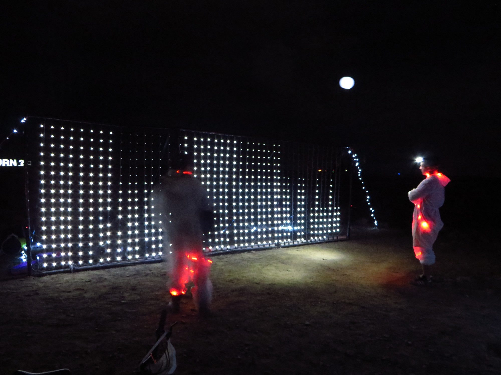
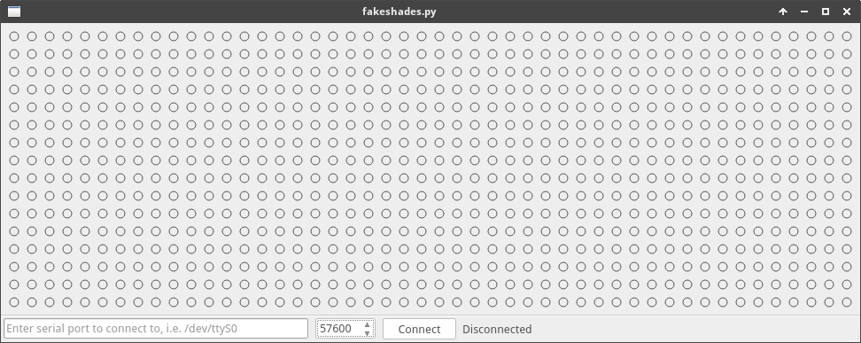

# fakeshades-pyqt
An software emulator for the 16shades project, using PyQt to create a virtual 48x16 LED matrix.

## Background

The 16shades project is an electronic installation where a matrix of single colour LEDs is configured as a basic display, capable of 4 bits (16) levels of brightness.

Originally I had attached the LEDs to the [blinds in my apartment](https://www.youtube.com/watch?v=nrp4Zgn8_60). I have since embedded the columns of LEDs to a PVC frame, which was a registered installation at the [AfrikaBurn](www.afrikaburn.com) festival



## Overview 

To help speed up development of new display graphics for the 16shades installation I have created a "virtual" display using PyQt. The application listens on the designated serial port for a 16shades frame. It converts the frame data into brightness values to be displayed on the grid.



## Install

*NB: I have only tested this on a Linux environment with Python 3.*

I recommend using pip to install the required Python packages:

```$ pip install -r requirements.txt```

## Usage

To use the application you should have a serial port on which to listen for data. This could be a real serial port attached to a device such as an Arduino or Raspberry Pi, or it could be a virtual serial port. If you wish to test the application you can use virtual serial ports.

To test using virtual serial ports run the ```socat``` command to create two virtual devices:

```
$ socat -d -d pty,raw,echo=0 pty,raw,echo=0
2016/05/24 18:41:09 socat[11174] N PTY is /dev/pts/6
2016/05/24 18:41:09 socat[11174] N PTY is /dev/pts/7
2016/05/24 18:41:09 socat[11174] N starting data transfer loop with FDs [5,5] and [7,7]
```

You can now attach to these devices to send and receive data. If you send on one device, you will receive it on the other. In our test we will be listening on ```/dev/pts/6``` and sending data on ```/dev/pts/7```.

- Set the serial port in the fakeshades application (bottom left of the application) to be ```/dev/pts/6```.
- Open the ```testgenerator.py``` file and make sure the serial port to be opened is ```/dev/pts/7```.
- Make sure that you have a matching baud rate in both cases.
- Run the fakeshades application: ```$ python fakeshades.py```
- Click the ```Connect``` button in the fakeshades application. Observe the status bar - it should change to say ```Connected```.
- Run the test generator script: ```% python testgenerator.py```
- You should see the first two columns in the fake shades application change to the following:


## 16shades Frame Format

The frame format for 16shades is as follows:

- First 4 bytes are the fixed header bytes: ```0xba 0x5e 0xba 0x11```
- 5th byte indicates the number of columns being transmitted: i.e. ```0x02```
- 6th byte indicates the number of rows being transmitted: i.e. ```0x10```
- In this example there will be a total of 2 (0x02) x 16 (0x10) = 32 LED brightness values being transmitted.
- Each LED brightness is transmitted sequentially in 4 bits - so each byte transmitted contains brightness values for 2 LEDs.
- In this example for 32 LEDs that means that 16 bytes total will be transmitted to convey the brightness data.
- Next x bytes are the brightness values. 
- ```0x00``` means the LED is off.
- ```0x0F``` is max brightness for that LED.
